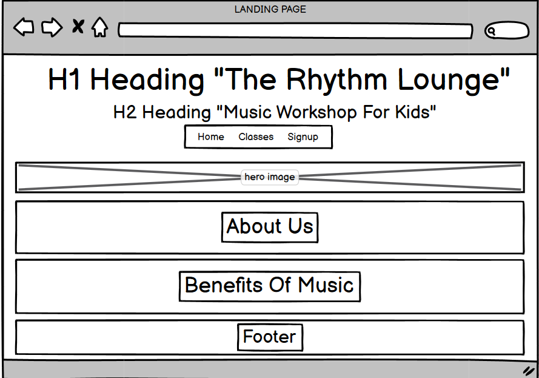

# The Rhythm Lounge 

Description of site here - add link to live site and mockup of site responsiveness here also. 

# Features 

Enter features of the site, explain why there are there - include navigation, footer, favicon (if applicable), lading page, classes page and sign up page. include screenshots of everything working as it should. 

# Design

Home Page

# Technologys 

What i used to build the site and why i used it. 

# Testing 

How i tested the site, my expected outcomes and my actual outcomes. 

# Deployement 

What i used to deploy and how i did it. 

# Credits 

anything i used to help me make the site. 

#
