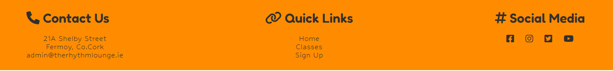
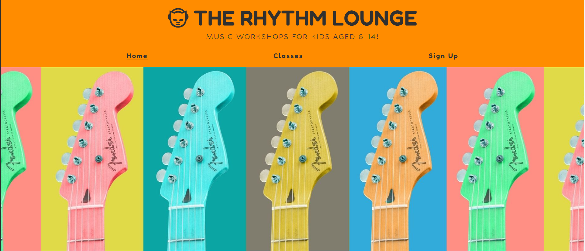
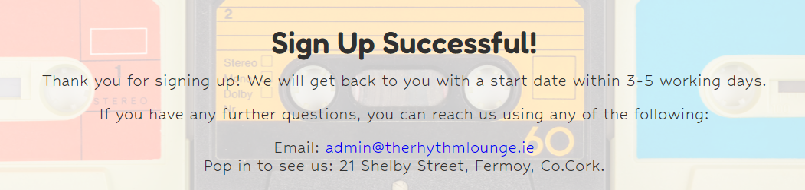
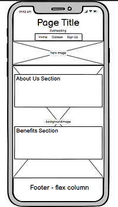
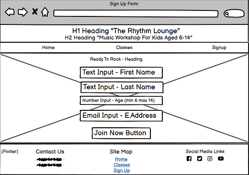
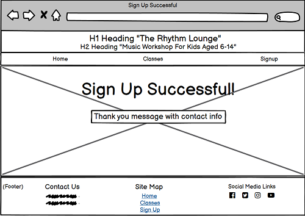

# The Rhythm Lounge 

Description of site here - add link to live site and mockup of site responsiveness here also. 

The Rhythm Lounge is a website that allows the user to sign their kids (aged 6-14) up for music workshops. These workshops include piano, guitar, vocals, drums and songwriting. The website aims to inform the user of the benefits a child gains from learning music at a younge age. View the live site here. ( insert live link when deployed)

# Features 

Enter features of the site, explain why there are there - include navigation, footer, favicon (if applicable), lading page, classes page and sign up page. include screenshots of everything working as it should. 

## Site Wide 

### Navigation 
* Contains links to the home, classes and sign up page. Will be reponsive across all devices.
* This will enable users to easily navigate their way around the website on any device.

## Footer
* Will contain contact information and link to email which will automatically open their default mail application and pre-fill the address bar. 
* Will contain a site map with links to other pages on the site so the user can navigate to these pages without having to scroll back to the main nav menu. 
* Will contain links to social media where the user can get more information on the workshops. All links will have aria labels to assist screen readers and each link will open in a new tab. 

## Favicon 
* Sitewide favicon will be enabled with The Rhythm Lounge logo. 

* This will show an image in the tabs header will will allow the user to clearly indentify the site if they have multiple tabs open. 

## Landing Page
### Landing Page Image
* The hero image is a static image of colourful guitars.
* This will give the user a general idea of what the website is about before they start scrolling. 

### About Us Information
* This section will give the user a brief introduction to The Rhythm Lounge. 
* This information lets the user know what the website is about. 

### Benefits Information
* This section will inform the user of the benefits that children can avail of by learning music at a young age. 
* The purpose of this section is to entice the user to sign their child up for lessons. 

* Both sections have a partially transparent static background image to keep the design consistant.

## Classes Page 

### Classes Page Image 
* The classes image will be a static partially tranparent background image of various colourful tapes.
* The purpose of this image is to keep the design consistant. 

### Classes Content
* The content found on the classes page will inform the user on what workshops TRL ( The Rhythm Lounge ) offers. Days, times and some class content will also be included so the user has as much information as possible before signing up. 
* The purpose of this content is to show the user that there are various workshops to choose from. 

## Sign Up Page 
* The sign up page will consist of a form complete with all fields nessesary to gather relevant information. Such as: 
First Name (type=text)
Last Name ( type=text)
Email ( type=email)
Age (type=number)
Workshop Choice ( type= radio )
* The purpose of this form is to allow the user to sign up for TRL. 

* Upon completion, the user will be redirected to sign-up-successfull.html where they will be met with a Submission successful message. 
* The purpose of this message is to inform the user that their submission has been successful. 

## Exsiting Features 
* Responsive Design 
* Contact form & success page
* 404 page

## Features Left to Implement 
* As a future enhancement, the contact form will be updated with JavaScript. This will send an email to TRL with the sign up information. 
* Gallery to be added with photos from the workshops.

# Design

## Site Wide 

### Colours 

The colours used will be Orange ( primary background colour ) and Dark Grey ( Primary heading & content colour ).
I will add 

## Wireframes 
* I designed wireframes to give myself a rough idea of what i wanted the site to look like. 
* I did this to save myself time by not designing as i go. 

### Home Page

### Classes Page

### Sign Up Page 

### Form Successful Page 

### 404 Page

# Technologys 

What i used to build the site and why i used it. 

# Testing 

How i tested the site, my expected outcomes and my actual outcomes. 

# Deployement 

What i used to deploy and how i did it. 

# Credits 

anything i used to help me make the site. 

#
