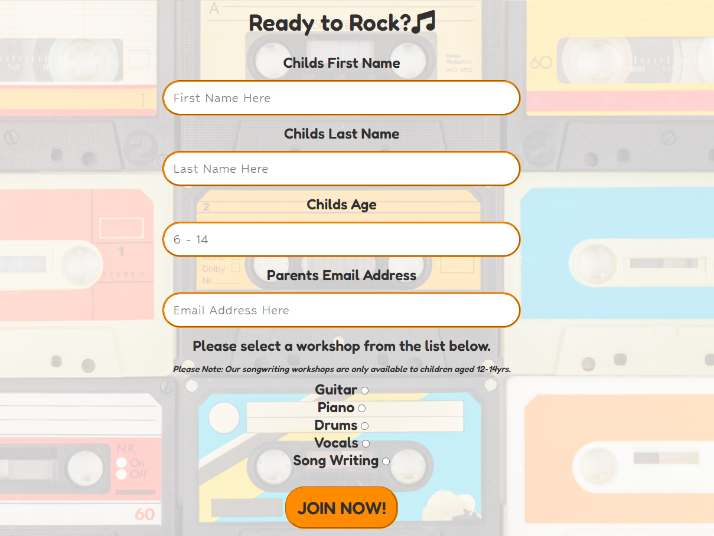
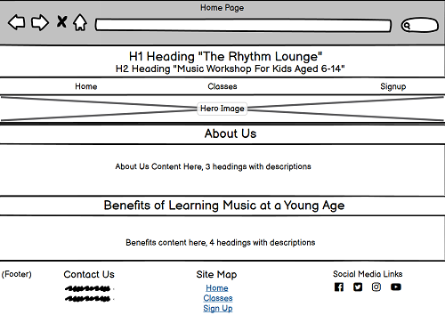
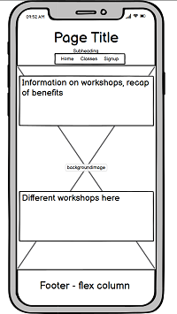

# The Rhythm Lounge 

The Rhythm Lounge is a website that allows the user to sign their kids (aged 6-14) up for music workshops. These workshops include piano, guitar, vocals, drums and songwriting. The website aims to inform the user of the benefits a child gains from learning music at a younge age which will in turn, entice them to sign their child up for a workshop. View the live site here: https://beccaob.github.io/the-rhythm-lounge-pp1/

## Website Mock-up

View all pages on the mockup generator here https://techsini.com/multi-mockup/?url=https://beccaob.github.io/the-rhythm-lounge-pp1/

# Features 

## Site Wide 

### Navigation 
* Contains links to the home, classes and sign up page. Will be reponsive across all devices.
* This will enable users to easily navigate their way around the website on any device.

## Footer
* Will contain contact information and link to email which will automatically open their default mail application and pre-fill the address bar. 
* Will contain a site map with links to other pages on the site so the user can navigate to these pages without having to scroll back to the main nav menu. 
* Will contain links to social media where the user can get more information on the workshops. All links will have aria labels to assist screen readers and each link will open in a new tab. 

## Favicon 
* Sitewide favicon will be enabled with The Rhythm Lounge logo. 

* This will show an image in the tabs header will will allow the user to clearly indentify the site if they have multiple tabs open. 

## Landing Page
### Landing Page Image
* The hero image is a static image of colourful guitars.
* This will give the user a general idea of what the website is about before they start scrolling. 

### About Us Information
* This section will give the user a brief introduction to The Rhythm Lounge. 
* This information lets the user know what the website is about. 

### Benefits Information
* This section will inform the user of the benefits that children can avail of by learning music at a young age. 
* The purpose of this section is to entice the user to sign their child up for lessons. 

* Both sections have a partially transparent static background image to keep the design consistant.

## Classes Page 

### Classes Page Image 
* The classes image will be a static partially tranparent background image of various colourful tapes.
* The purpose of this image is to keep the design consistant. 

### Classes Content
* The content found on the classes page will inform the user on what workshops TRL ( The Rhythm Lounge ) offers. Days, times and some class content will also be included so the user has as much information as possible before signing up. 
* The purpose of this content is to show the user that there are various workshops to choose from. 

## Sign Up Page 
* The sign up page will consist of a form complete with all fields nessesary to gather relevant information. Such as: 
First Name (type=text)
Last Name ( type=text)
Email ( type=email)
Age (type=number)
Workshop Choice ( type= radio )
* The purpose of this form is to allow the user to sign their child up for TRL. 

* Upon completion, the user will be redirected to sign-up-successfull.html where they will be met with a Submission successful message. 
* The purpose of this message is to inform the user that their submission has been successful. 

## Exsiting Features 
* Responsive Design 
* Contact form & success page
* 404 page

## Features Left to Implement 
* As a future enhancement, the contact form will be updated with JavaScript. This will send an email to TRL with the sign up information. 
* Gallery to be added with photos from the workshops.

# Target Audience

TRL's target audience are parents of 6-12 year olds. The website was designed in a way that would appeal to both the parent and the child. 

## Parent

The content is targeted to the parent. Each section of TRL is concise and informative with the end goal being the childs enrollment. 

## Child

The design is targeted to the child. The fonts & colors used are similar to childrens TV channels such as Nickelodeon, Nick Jr., Disney Channel, etc. The objective is to connect the fun of these channels to the potential fun one could have with TRL. 

# User Stories 

1. Sarah 
Sarah does not have any children enrolled in The Rhythm Lounge.
    * Wants To: Know more about the benefits of music in young children
    * End Goal: Feel Informed 

Outcome: Sarah can reach her end goal of feeling informed by navigating to the sites 'Benefits Of Learning Music at a Young Age' section of the home page. 

2. Daniel
Daniel has one child enrolled in TRL Drums class. 
    * Wants To: Remind himself of the Drum lesson time 
    * End Goal: Know the Drum schedule

Outcome: Daniel can navigate to the 'Classes' page of the site and scroll down to the 'Drums' section to remind himself of the schedule. 

3. Imelda 
Imelda is enrolling one of her children in TRL. 
    * Wants To: Enroll her child in TRL's piano lessons
    * End Goal: To know her child is enrolled

Outcome: Imelda can navigate to the 'Sign Up' page and fill out the relevant information. If she fills this out correctly, she will be redirected to a submission successful page. This page lets Imelda know that her child is enrolled. 
    

# Design

## Site Wide 

### Colours 

The colours used will be Orange ( primary background colour ) and Dark Grey ( Primary heading & content colour ).
Colourful images will be used to keep the design consisitant. 

## Wireframes 
* I designed wireframes to give myself a rough idea of what i wanted the site to look like. 
* I did this to save myself time by not designing as i go. 

### Home Page

### Classes Page

### Sign Up Page 

### Form Successful Page 

### 404 Page

# Technologys 

## HTML
* The websites structure was developed using HTML as the main language.

## CSS
* The website was styles using custom CSS in an external file.

## Visual Studio Code 
* The website was developed using VS Code. 

## Github 
* TRL source code is hosted on Github & deployed using Git Pages. 

## Git
* Used to commit and push code throughout the development process. 

## Font Awesome 
* Icons from https://fontawesome.com/ were used in the headings and social media icons on the site. 

## Favicon.io 
* Favicon files were created using https://favicon.io

## Balsamiq 
* Wireframes were created using Balsamiq from https://balsamiq.com/wireframes/desktop/

## NVDA
* Manual accessibility text ran using NDVA. (https://www.nvaccess.org/)

## Images
* Images were created using Canva Pro from https://www.canva.com/ 
* Stuck within licence guidlines ( see below )

# Testing 

## Responsivness 

All pages were tested to ensure responsivness on screen sizes from 320px upwards. Each page was tested on Chrome, Edge and Firefox. 

Steps to test: 
1. Open browser and navigate to [The Rhythm Lounge](https://beccaob.github.io/the-rhythm-lounge-pp1/index.html)
2. Open the developer tools ( right click & inspect )
3. Set to responsive & decrease width to 320px
4. Set the zoom to 50%
5. Click & drag window to max width

Expected Outcome: 
* Responsive on all screen sizes, no pixelated/streched images
* No horizontal scroll bar
* No element overflow

Actual Outcome: 

The website behaved as expected across all tests. 

The site was also tested on the following devices and no issues were detected: 

* Apple IPhone 13 
* One Plus 7T 
* Samsung A32
* Asus 15.6" M509DA-EJ034T   
* HP Pro Desk 400 G6 SFF

## Accessibility

[Wave Accessibility Tool](https://wave.webaim.org/) was used throughout development and for the final testing of the website. 

Testing was targerted towards ensuring the following criteria was met: 
* All forms have associated labels so it's read out on a screen reader to users who tab to form inputs.
* Color contrasts meet the minimum requirements specified in WCAG Contrast Guidelines. 
* All content is contained within landmarks to allow the user to navigate by page region.
* Heading levels are not skipped or missed. This will ensure the importance of content is convayed to the user. 
* All images have alt attributes or titles so screen readers can read the description to the user. 
* HTML page langugae has been set. 

A manual test was conducted 23/03/22 using NVDA and no accessibility issues were uncovered. 

## Lighthouse Testing

* Home Page

* Classes Page

* Sign Up Page

## Functional Testing 

### Nav Links 
Testing was performed to ensure links on all pages navigated to the correct place as per design. This was done by clicking on the nav links on each page ( menu & footer )

Expected Outcome: 
* All links navigate to correct page

Actual Outcome:
* Outcome as expected

### Form Testing

The sign up form was tested to ensure it performed as expected when correct/incorrect data was inputted. The following tests were performed: 

#### Correct Inputs 

Steps to test: 
1. Navigate to {Sign Up - The Rhythm Lounge}(https://beccaob.github.io/the-rhythm-lounge-pp1/sign-up.html)
2. Input the following data:
    * First Name: Jane
    * Last Name: Doe
    * Age: 12
    * Email: j.doe@test.com
3. Choose workshop
4. Click 'Join Now' 
5. User should be redirected to sign-up-successful.html confirmation page

Expected: 

* Form submits with no errors and user is redirected to confirmation page mentioned above. 

Actual: 

* Website behaved as expected with no errors/warnings and user was redirected correctly.

#### Missing First Name Input 

Steps to test:

1. Navigate to {Sign Up - The Rhythm Lounge}(https://beccaob.github.io/the-rhythm-lounge-pp1/sign-up.html)
2. Input the following data:
    * First Name:
    * Last Name: Doe
    * Age: 12
    * Email: j.doe@test.com
3. Choose workshop
4. Click 'Join Now' 
5. User should not be redirected to sign-up-successful.html confirmation page

Expected: 

* Form doesn't submit & an error is displayed. User is not redirected to confirmation page mentioned above. 

Actual: 

* Website behaved as expected, error message was displayed and the form didn't submit. User was not redirected to confirmation page.

#### Missing Last Name Input 

Steps to test:

1. Navigate to {Sign Up - The Rhythm Lounge}(https://beccaob.github.io/the-rhythm-lounge-pp1/sign-up.html)
2. Input the following data:
    * First Name:
    * Last Name: Doe
    * Age: 12
    * Email: j.doe@test.com
3. Choose workshop
4. Click 'Join Now' 
5. User should not be redirected to sign-up-successful.html confirmation page

Expected: 

* Form doesn't submit & an error is displayed. User is not redirected to confirmation page mentioned above. 

Actual: 

* Website behaved as expected, error message was displayed and the form didn't submit. User was not redirected to confirmation page.

#### Missing Age Input 

Steps to test:

1. Navigate to {Sign Up - The Rhythm Lounge}(https://beccaob.github.io/the-rhythm-lounge-pp1/sign-up.html)
2. Input the following data:
    * First Name:
    * Last Name: Doe
    * Age: 12
    * Email: j.doe@test.com
3. Choose workshop
4. Click 'Join Now' 
5. User should not be redirected to sign-up-successful.html confirmation page

Expected: 

* Form doesn't submit & ean error is displayed. User is not redirected to confirmation page mentioned above. 

Actual: 

* Website behaved as expected, error message was displayed and the form didn't submit. User was not redirected to confirmation page.

#### Inputting higher than allowed (6-14) age in Age Input 

Steps to test:

1. Navigate to {Sign Up - The Rhythm Lounge}(https://beccaob.github.io/the-rhythm-lounge-pp1/sign-up.html)
2. Input the following data:
    * First Name:
    * Last Name: Doe
    * Age: 12
    * Email: j.doe@test.com
3. Choose workshop
4. Click 'Join Now' 
5. User should not be redirected to sign-up-successful.html confirmation page

Expected: 

* Form doesn't submit & ean error is displayed. User is not redirected to confirmation page mentioned above. 

Actual: 

* Website behaved as expected, error message was displayed and the form didn't submit. User was not redirected to confirmation page.

#### Inputting lower than allowed (6-14) age in Age Input 

Steps to test:

1. Navigate to {Sign Up - The Rhythm Lounge}(https://beccaob.github.io/the-rhythm-lounge-pp1/sign-up.html)
2. Input the following data:
    * First Name:
    * Last Name: Doe
    * Age: 12
    * Email: j.doe@test.com
3. Choose workshop
4. Click 'Join Now' 
5. User should not be redirected to sign-up-successful.html confirmation page

Expected: 

* Form doesn't submit & ean error is displayed. User is not redirected to confirmation page mentioned above. 

Actual: 

* Website behaved as expected, error message was displayed and the form didn't submit. User was not redirected to confirmation page.

#### Incorrect email format in Email input

Steps to test:

1. Navigate to {Sign Up - The Rhythm Lounge}(https://beccaob.github.io/the-rhythm-lounge-pp1/sign-up.html)
2. Input the following data:
    * First Name:
    * Last Name: Doe
    * Age: 12
    * Email: j.doe@test.com
3. Choose workshop
4. Click 'Join Now' 
5. User should not be redirected to sign-up-successful.html confirmation page

Expected: 

* Form doesn't submit & ean error is displayed. User is not redirected to confirmation page mentioned above. 

Actual: 

* Website behaved as expected, error message was displayed and the form didn't submit. User was not redirected to confirmation page.

#### Inputting higher than allowed (6-14) age in Age Input 

Steps to test:

1. Navigate to {Sign Up - The Rhythm Lounge}(https://beccaob.github.io/the-rhythm-lounge-pp1/sign-up.html)
2. Input the following data:
    * First Name:
    * Last Name: Doe
    * Age: 12
    * Email: j.doe@test.com
3. Choose workshop
4. Click 'Join Now' 
5. User should not be redirected to sign-up-successful.html confirmation page

Expected: 

* Form doesn't submit & ean error is displayed. User is not redirected to confirmation page mentioned above. 

Actual: 

* Website behaved as expected, error message was displayed and the form didn't submit. User was not redirected to confirmation page.

#### Not selecting a workshop radioo button

Steps to test:

1. Navigate to {Sign Up - The Rhythm Lounge}(https://beccaob.github.io/the-rhythm-lounge-pp1/sign-up.html)
2. Input the following data:
    * First Name:
    * Last Name: Doe
    * Age: 12
    * Email: j.doe@test.com
3. Dont choose workshop option
4. Click 'Join Now' 
5. User should not be redirected to sign-up-successful.html confirmation page

Expected: 

* Form doesn't submit & ean error is displayed. User is not redirected to confirmation page mentioned above. 

Actual: 

* Website behaved as expected, error message was displayed and the form didn't submit. User was not redirected to confirmation page.

## Footer Social Icons

Testing ws performed on the social media icons to ensure each opened in a new tab and had a hover affect of the underline. 

As expected, each icon opened in a new tab and correct underline was present. 

## Footer Contact Information

Testing was performed on the email in the 'Contact Us' section of the footer to ensure it opened the users default mail application. 

Steps to test: 
1. Navigate to {The Rhythm Lounge}(https://beccaob.github.io/the-rhythm-lounge-pp1/index.html)
2. Click the email address in the footer ( admin@therhythmlounge.ie )

Expected: 
Default mail application is opened and 'To' address bar is pre-filled. 

Actual: Behaviour was as expected. See screenshot below: 

# Validator Testing 

## HTML 

No errors were presented when running through the official W3C Validator. 

## CSS
No errors were presented when running through the official Jigsaw Validator.

# Deployement 

The website was created using Visual Studio Code editor and pushed to the github remote repository 'the-rhythm-lounge-pp1'
The following git commands were used throughout development to push code to the remote repository: 

* git add . 
    * This command was used to add a change in the working directory to the staging area. 

* git commit -m "commit message"
    * This command was used to commit changes to the local repo queue ready to be pushed to the remote repo. 

* git push
    * This command was used to push all committed code to the remote repo on github. 

## Deployment to Github Pages

The site was deployed to Github Pages. Steps used are as follows: 
1. In the repo, open the settings tab
2. In left menu, click 'Pages'
3. From the source section, select 'Branch:main' from the dropdown menu
4. Click 'Save'
5. A live link will be displayed in green banner when published successfully

The live link to The Rhythm Lounge can be found here: https://beccaob.github.io/the-rhythm-lounge-pp1/

## Clone Repo Code Locally 

Navigate to the github repo you want to clone for local use

1. Click the 'Code' drop down menu
2. Click on 'HTTPS' 
3. Copy the repo link to the keyboard 
4. Open preferred integrated development environment (IDE) 

(Git must be installed for the final step) 

5. Type git clone copied-git-url into the IDE terminal

The project will now be cloned on your local machine.

# Credits 

## Images

* Home & Classes Background Image: 'Collection Of Different Vintage Audio Compact Cassettes' - Martin Bergsma

* Sign Up Background Image: 'Vintage Audio Compact Cassettes' - Martin Bergsma

* Hero Image: 'Untitled' - Rahu from Pixabay

## Flexbox Froggy 

* Used to familiarlize myself with using flexbox.
    * https://flexboxfroggy.com/

## Unicorn Revealer 
* Chrome extention used to highlight overflow. 
    * Can be downloaded here: https://chrome.google.com/webstore/detail/unicorn-revealer/lmlkphhdlngaicolpmaakfmhplagoaln?hl=en-GB

## Multi Device Website Mockup Generator 
* Used to test responsiveness on Apple devices. Screenshotted for readme.md file. 
    * Can be accessed here: https://techsini.com/multi-mockup/

## Code Institute Sample README.md 
* Used as a template to create README.md for the wesbite. 
    * Can be accessed here: https://github.com/Code-Institute-Solutions/readme-template

## Github Markdown Cheat Sheet
* Used to write README.md
    * Can be accessed here: https://docs.github.com/en/get-started/writing-on-github/getting-started-with-writing-and-formatting-on-github/basic-writing-and-formatting-syntax

#
